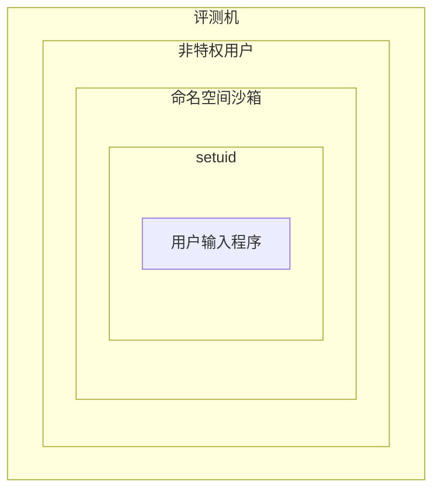

# Sandbox

## 评测沙箱概览

`judger2/sandbox` 里的评测沙箱利用了一系列 Linux syscall
来实现对系统安全的保护。



## 非特权用户

总不会有人用 root 去跑用户输入的程序……吧？

## 命名空间沙箱

我们用 Google 的 [nsjail] 来实现以下功能:

- 最长时间限制 (时限 +1s)
- chroot (其实是 [pivot_root(2)][pivot-root])
  - 禁止执行 /bin 和 /usr/bin 里的二进制
  - 禁止访问 /proc /sys /tmp /dev
  - 禁止提交的程序访问输入输出文件
  - 限制对文件的写操作
- 限制网络访问
- 限制至多使用一个 cpu 核 (防止多线程加速)

在底层，主要使用的是 [namespaces(7)][ns] API。

[nsjail]: https://github.com/google/nsjail
[pivot-root]: https://man7.org/linux/man-pages/man2/pivot_root.2.html
[ns]: https://man7.org/linux/man-pages/man7/namespaces.7.html

## setuid 沙箱 (aka runner.c)

在包着一层 nsjail 的情况下，我们没办法精确地测量用户程序的执行用时和内存使用，
因为 Linux 没有简单的办法在进程退出后获取任意进程的资源使用情况。
因此，我们在 nsjail 里面跑一个我们自己的小程序用来测量这些参数。
这个小程序就是 runner.c。它将测量结果输出到一个文件里 (因为
stdout 和 stderr 都有可能要用)，而这个文件又不希望被用户执行的程序访问到
(否则用户就可以自己写这个文件然后直接消除 TLE 和 MLE 了)。
因此，我们让 runner.c 再 drop 一次 privilege，让它 [setuid(2)][suid]
到一个权限更低的用户上去，再执行用户程序;
更改测量结果文件的权限使得新用户无法打开它。
而这时候 group 并没有变化，所以依然可以借着 group
的权限写一些中间过程所需要的文件 (e.g. 编译产物, 数据文件, etc.)

那这个 setuid 应该切换到什么用户? 整个 runner 是在一个 nsjail 造出的新的
[user namespace][user-ns-lwn] 里面的，而且评测机主进程显然并不是以 root 运行的;
我们也不希望评测机本身能借助 (强行给它的) CAP_SETUID 切换到其他用户,
否则它直接一个 `setuid(0)` 就成 root 了。

幸好，我们可以用 [subuid] 将一大堆 user id 在 user namespace
里全部都映射到外面的评测机用户上，这样给 runner 一个 CAP_SETUID
之后它就可以切到权限更低的用户上了。我们在安装指南里用到的:

```
ojrunner:100000:65536
```

就是将 100000\~165535 这 65536 个 userid 全部分配给 ojrunner 这个用户，
让它能在 user namespace 里创建这些 userid 的映射。
在评测机里，我们只用到了这些 uid 中的一个，在默认配置下就是 100001。
我们将沙箱内的 uid=65534 映射到沙箱外的 uid=100001, 然后在沙箱里让
runner setuid 到 65534 再执行用户程序，就可以防止用户程序乱搞评测机状态了。

[suid]: https://man7.org/linux/man-pages/man2/setuid.2.html
[user-ns-lwn]: https://lwn.net/Articles/532593/
[subuid]: https://www.funtoo.org/LXD/What_are_subuids_and_subgids%3F

## 关于时间限制

评测机共有这样几个时间限制:

0. 任何评测任务 (JudgeTask) 用时不得超过一个小时 (scheduler 实现)。
   这是为了防止评测机出现极端意外情况而设置的。
0. nsjail 的时间限制: 规定的时间限制 +1 s。
   因为 runner 的限制不是硬限制，所以 nsjail 这里还需要卡一下，防止有人卡评测。
0. runner 的时间限制: 规定的时间限制 +1 ms。
   通过 [setitimer(2)][setitimer] 实现，用户程序可以取消这个时间限制。
   几乎所有情况下这个时间限制都是好使的，所以 nsjail 的时限不会真正触发。
   这个时限到了之后，runner 主进程仍在运行，仍然能收集精确的时间和内存信息，
   以及程序返回值的信息。而 nsjail 的时限到了之后，runner 会被一起干掉，
   只能通过 Python 获得一个不精确的信息。

[setitimer]: https://man7.org/linux/man-pages/man2/setitimer.2.html

## 关于几个沙箱的测试程序

### mem.c

会占用一些内存，然后输出自己的内存占用情况。用来测量评测机内存测量的
overhead。

注意对比的时候不能直接对比评测机和它输出的内存占用，两者一定是一样的；
要对比评测机运行它和它在评测机外面运行时的内存占用。

### test.s

直接调用 _exit(2) 退出程序。理论上应该用时接近为
0，用来测量评测机时间测量的 overhead。
