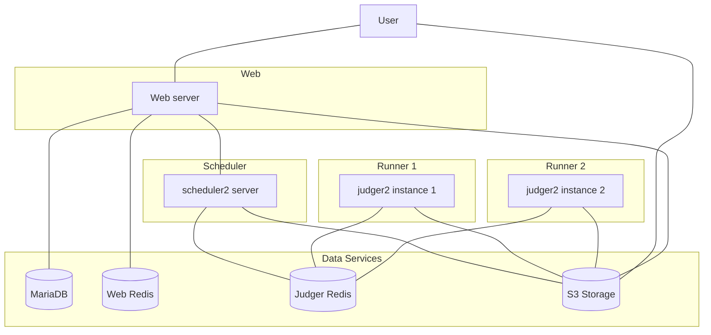
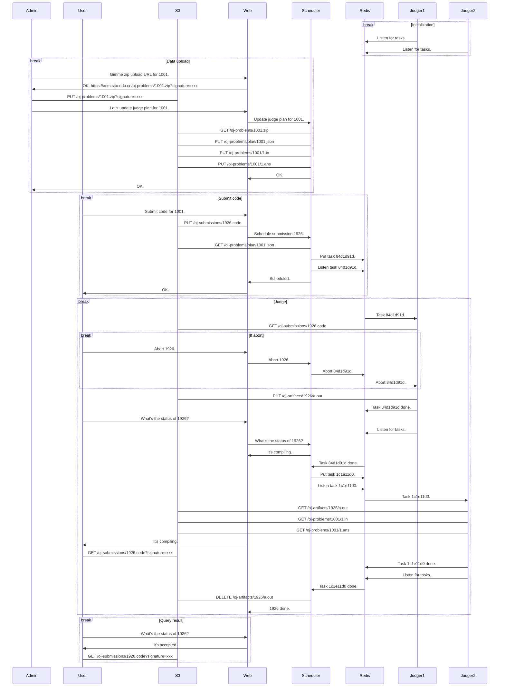

0\. Overview
============

## 设计原则

- 权限最小化
  - Web 服务器是较为可信的
    - Web 服务器可以访问所有重要资源
    - Web 服务器不能直接处理用户上传的文件，而应该交给调度机
  - 调度机在中间
    - 调度机不能访问主数据库，但是可以随意访问 s3
  - 评测机是不可信环境
    - 评测机只能访问传给它的 URL 里的文件
    - 评测机执行外部命令必须经过沙箱
- 评测并行化
  - 评测任务细分
  - 每次只评测一个最小单元而不是一整道题
- 评测可中断
  - 防止长时间评测任务 (e.g. 火车票) 无法打断造成资源浪费
- 合理使用数据服务
  - 文件存 s3，数据存 SQL，临时数据存 Redis
  - 大文件直接传 (Signed) URL
  - 管理员上传/下载题目 zip 不经过 web，直接传 s3
  - 代码也存在 s3 上面，以后可以让用户把代码直接传到 s3，不经过 Web
    - Use case: 提答题

## 总体架构图

## 评测流程

## 哪些组件需要公网可访问?

- Web server
- s3
  - s3 需要可以通过内外网两个接口访问
  - 外网接口的用途
    - 查看代码
    - 上传/下载题目 zip
    - 上传/查看图床图片

## 调度机和评测机的配置

调度机和评测机都有两个和配置相关的文件, 分别是
`{scheduler,runner}.yml` 和 `config.py`. `yml` 文件是不纳入
git 版本管理的, 是每台调度机/评测机独有的配置, 更改网络结构时,
从设计上来说应该只更改 `yml` 文件即可, 不用更改代码; 而 `py`
文件的作用是读入 `yml` 文件, 以及记录业务逻辑上的常量 (如
heartbeat 间隔时间、任务超时时间等) 等每台调度/评测机相同的参数,
或者应该纳入版本控制的参数, 但不应记录密钥、密码、access key
等敏感内容.
