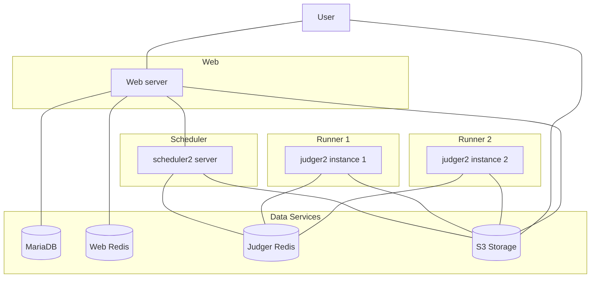

# TesutoHime / 评测姬

ACM Class OnlineJudge：新一代多线程分布式评测系统

ACMOJ 是以低年级本科生教学为导向的在线评测服务。在 ACM 班的教学中，有时候会用到一些一般的 OI/ICPC 类 OJ 所不具备的一些功能：

- 头文件评测 (用户提交头文件，`main` 函数包含于数据包中；类似于一些交互题)
- 多文件编译 (目前通过提交 Git 远端地址的方式实现)
- 内存泄漏检查 (Valgrind)
- 基础的 Verilog 评测
- 带文件 I/O 的评测 (多个数据点之间不删除用户程序产生的文件)

除了经典的算法题之外，OJ 上还有很多 ACM 班助教自编的程序设计、经典数据结构 (如红黑树、B+ 树等) 等题目，以适应课程的需要。

## 功能

### 用户端

- 题目内容浏览 (支持 markdown 与内嵌 LaTeX)；
- 题目列表，翻页；
- 比赛 (按照分数、排名，计算并列后名次，点击跳转指定人指定题评测结果)；
- 作业 (不排名，表格显示题目通过与否，点击跳转指定人指定题评测结果)；
- 考试 (按照分数、排名，计算并列后名次，点击跳转指定人指定题评测结果，限制参加者查看他人代码及自己过往代码的权限，不允许查看讨论区)；
- 代码题提交评测，语言选择，语言自动检测，代码高亮；
- 填选题与填选评测；
- 评测序列，搜索，翻页，查看指定用户用户名；
- 代码查看，代码高亮，(可以查看别人代码，仅在比赛和作业时对参赛选手进行限制)，运行结果查看 (可选输出错误结果、输出 CE 信息)；
- 讨论区：每道题目自带一个支持 markdown 的论坛式讨论版；
- 支持锁定题目到指定时间 (Unix Nano)；
- 图片采用内置图床，详见管理端功能。

### 管理端

- 新增、修改、删除题目 (可设定时间、内存、测试点数量、SPJ)；
- 新增、修改、删除比赛；
- 重测、取消成绩、终止评测题目；
- 添加实名；
- (仅超级管理员) 修改用户信息。

### 评测端

- 评测机、调度机、Web 服务等模块均可独立运行；
- 支持多语言评测 (C++, Git, Verilog)；
- 支持 Special Judge (参见[数据包格式规范文档](docs/user/data_doc.md#spj))；
- 沙箱 (编译、评测、评分期，使用 [nsjail](https://github.com/google/nsjail) 以限制资源使用)；
- 以最小评测单元 (而非一整道题) 为调度的最小粒度，并可中途打断。

## 部署

参见[部署概览](docs/deployment/overview.md)。

## 文档

### 用户文档

- [管理界面使用指南](docs/user/admin_doc.md)；
- [题面格式规范](docs/user/problem_format_doc.md)；
- [数据格式规范](docs/user/data_doc.md)；
- [数据包样例](docs/user/package_sample.md)。

### 开发文档

参见[开发文档概览](docs/dev/overview.md)。

### 服务器管理工具

参见[服务器管理工具文档](docs/scripts.md)。

### 架构图

## LICENSE

MIT License

Copyright (c) 2021 TesutoHime Dev Group

Permission is hereby granted, free of charge, to any person obtaining a copy
of this software and associated documentation files (the "Software"), to deal
in the Software without restriction, including without limitation the rights
to use, copy, modify, merge, publish, distribute, sublicense, and/or sell
copies of the Software, and to permit persons to whom the Software is
furnished to do so, subject to the following conditions:

The above copyright notice and this permission notice shall be included in all
copies or substantial portions of the Software.

THE SOFTWARE IS PROVIDED "AS IS", WITHOUT WARRANTY OF ANY KIND, EXPRESS OR
IMPLIED, INCLUDING BUT NOT LIMITED TO THE WARRANTIES OF MERCHANTABILITY,
FITNESS FOR A PARTICULAR PURPOSE AND NONINFRINGEMENT. IN NO EVENT SHALL THE
AUTHORS OR COPYRIGHT HOLDERS BE LIABLE FOR ANY CLAIM, DAMAGES OR OTHER
LIABILITY, WHETHER IN AN ACTION OF CONTRACT, TORT OR OTHERWISE, ARISING FROM,
OUT OF OR IN CONNECTION WITH THE SOFTWARE OR THE USE OR OTHER DEALINGS IN THE
SOFTWARE.
