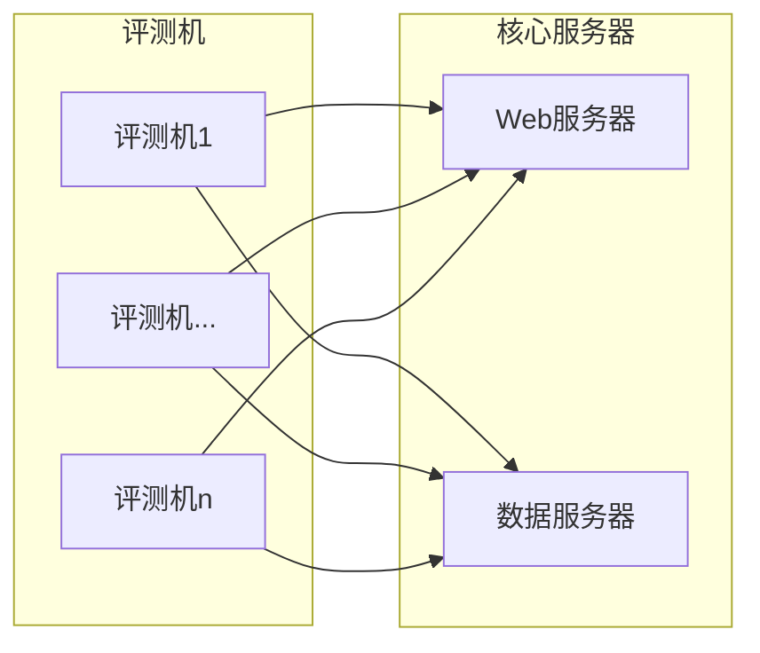

# TesutoHime

テスト姬(评测姬)

新一代多线程分布式评测系统

### 架构图

### 模块：

#### Web服务器

* html模板
* 逻辑交互核心
* 评测机调度器(含RPC接口)

#### 评测机：

* 评测核心
* 调度接口Client
* 数据服务Client

#### 数据服务器

* 数据服务Server

#### 其他

* 管理界面(运行于Web服务器上)
* 部分题目的可视化(与伟大思想课程合用，但与主系统可能并不紧密耦合)

### 功能

#### 用户端

题目浏览

比赛(按照分数、排名，计算并列后名次)

作业(不排名，表格显示题目通过与否)

题目浏览，搜索，翻页，**markdown支持**，图片采用外部图床

提交评测，语言选择，代码高亮

评测序列，搜索，翻页

代码查看，**代码高亮**，(可以查看别人代码，仅在比赛和作业时对参赛选手进行限制)，运行结果查看(可选输出错误结果、输出CE信息)

#### 管理端

题目添加(可设定时间、内存、测试点数量、**SPJ**(默认每道题目都有SPJ，全文比较和忽略空白比较是两种特殊的SPJ，由评测器内置实现，编译时限，磁盘空间限制))

#### 题目属性：

* 时间
* 内存
* 测试点数量(分组测试，失败跳过)(内存测试，并依赖正确性测试的结果(即：如果正确性测试失败，则不进行内存测试))
* **SPJ**(默认每道题目都有SPJ，全文比较和忽略空白比较是两种特殊的SPJ，由评测器内置实现)
* 编译时限
* 磁盘空间限制
* **交互题实现**

#### 接口：

题目属性存储方式：json(具体格式待定)

评测核心需要实现以下接口：

* 获得题号，代码，配置文件(json解析为字典，具体待定)，输出各个测试点结果、错误信息(python3元组嵌套，格式待定)

数据服务Client：

* 输入题号，自动获取题目数据，解压到缓存目录，返回解析后的题目配置文件(json解析为字典，具体待定)和题目数据根目录

逻辑交互核心、评测机调度器(含RPC接口)、调度接口Client 具体接口待定。

