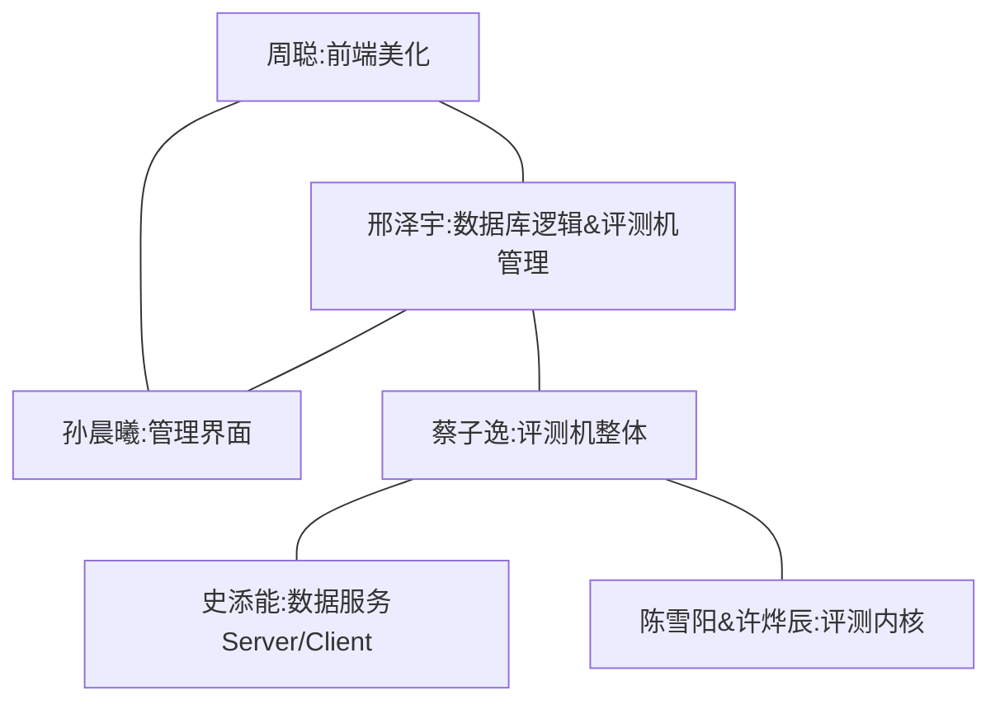
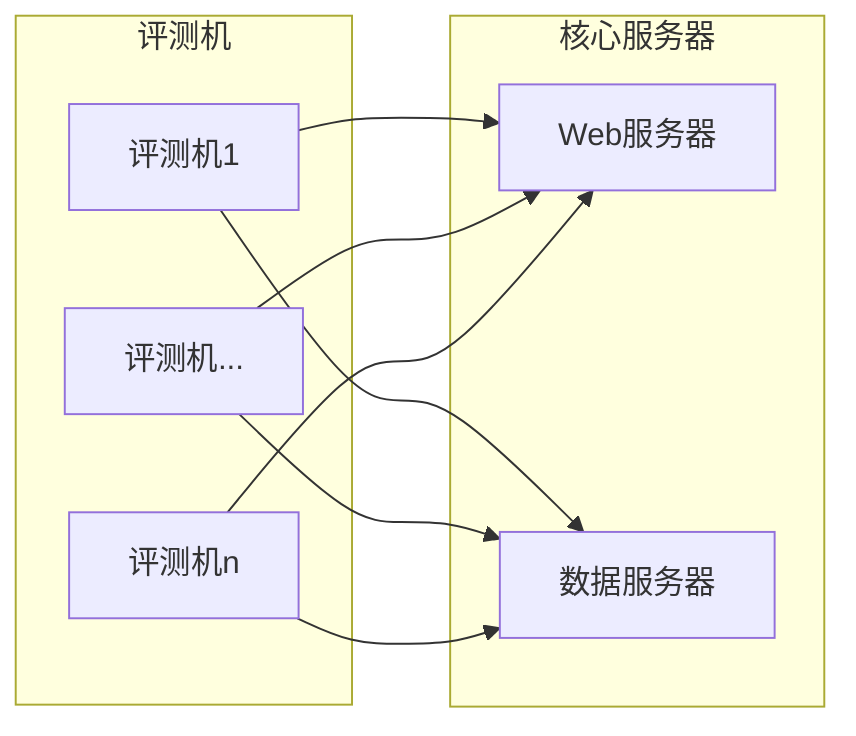

# TesutoHime

テスト姬(评测姬)

新一代多线程分布式评测系统

## Todo

* [x] Problem & Problem_List
* [x] Contest & Homework
* [x] Contest_List & Homework_List
* [x] Participate in Contest/Homework
* [x] Judge Status
* [ ] Judge Detail
* [x] Judge Server
* [x] Problem Details Markdown
* [x] Optimize Judge Status Search Behave
* [x] Judge Status Colorize & Contest_List/Homework_List Colorize
* [ ] Problem Detail Markdown Support
* [ ] System Integration
* [ ] Judge Status Beautify
* [ ] Discuss Board
* [x] Contest_List/Homework_List Reversal Display

#### 人员分工(对接结构)

### 架构图

### 模块：

#### Web服务器

* html模板
* 逻辑交互核心
* 评测机调度器(含RPC接口)

#### 评测机：

* 评测核心
* 调度接口Client
* 数据服务Client

#### 数据服务器

* 数据服务Server

#### 其他

* 管理界面(运行于Web服务器上)
* 部分题目的可视化(与伟大思想课程合用，但与主系统可能并不紧密耦合)

### 功能

#### 用户端

* 题目浏览
* 比赛(按照分数、排名，计算并列后名次)
* 作业(不排名，表格显示题目通过与否)
* 题目浏览，搜索，翻页，**markdown支持**，图片采用外部图床
* 提交评测，语言选择，代码高亮
* 评测序列，搜索，翻页
* 代码查看，**代码高亮**，(可以查看别人代码，仅在比赛和作业时对参赛选手进行限制)，运行结果查看(可选输出错误结果、输出CE信息)
* 讨论区：每道题目自带一个支持markdown的论坛式讨论版，**在题目处于被加入比赛、作业中时禁用**。
* 支持锁定题目到指定时间(Unix Nano)。

#### 管理端

题目添加(可设定时间、内存、测试点数量、**SPJ**(默认每道题目都有SPJ，全文比较和忽略空白比较是两种特殊的SPJ，由评测器内置实现，编译时限，磁盘空间限制))

#### 题目属性：

* 时间
* 内存
* 测试点数量(分组测试，失败跳过)(内存测试，并依赖正确性测试的结果(即：如果正确性测试失败，则不进行内存测试))
* **SPJ(C++，接口待定)**(默认每道题目都有SPJ，全文比较和忽略空白比较是两种特殊的SPJ，由评测器内置实现)
* 编译时限
* 磁盘空间限制
* **交互题实现**
* 提答
* 语言支持(C++，Git Repo(基于CMake、Make构建))
* 评分器(Python3)：给定每个测试点的分数、时间限制、空间限制、磁盘限制、答案得分，使用时间、使用空间、使用磁盘，计算本次提交本题获得的分数。**注意这不是SPJ**

#### 接口：

题目属性存储方式：json(具体格式待定)

评测核心需要实现以下接口：

* 参数：题号、解答、提交ID。返回值：评测结果(每个测试点的得分、时间使用、空间使用、磁盘使用构成的json)

数据服务Client：

* 输入题号，自动获取题目数据，解压到缓存目录，返回解析后的题目配置文件(json解析为字典，具体待定)和题目数据根目录
* **为及时同步数据修改，数据服务Client需存储当前zip包的哈希(md5, sha1)，并每次与获取Server端的哈希比较。若哈希值发生改变，说明测试数据已被更新，需要重新拉取**

逻辑交互核心、评测机调度器(含RPC接口)、调度接口Client 具体接口待定。

#### 关于评测机调度：

Web服务器存储当前可用评测机列表。

评测机调度接口Client：
* Get接口，输入题号、解答、Web服务器ID(一串ASCII字符)，若服务器ID正确，则加入本机评测序列。通过Web服务器上的Get接口返回是否成功。
* Get接口，表示当前评测机是否正忙。(同样需要两次ID发送，Web服务器ID错误时拒绝响应)
* 心跳包发送：定期向Web服务器发送当前评测机ID和状态(ID暂定为一串ASCII字符，类似密码，用于防止Web服务器端口暴露后被伪造评测机)。
* 评测完成后，向Web服务器以Post方式发送评测结果(json)。

评测机调度策略：
* 评测机离线判定：当前时间-上次心跳包时间>=2*发送周期。
* 当有在线评测机空闲时，优先使用该评测机。空闲机器较多时，随机一台使用。
* 当所有评测机忙时，提交加入队列。
* 当有评测机完成评测时，检查队列，若非空，则取出第一个评测交给该评测机。
* 如果评测机在评测中离线，显示本次提交为System Error。管理员手动检查评测机是否遭到攻击。

